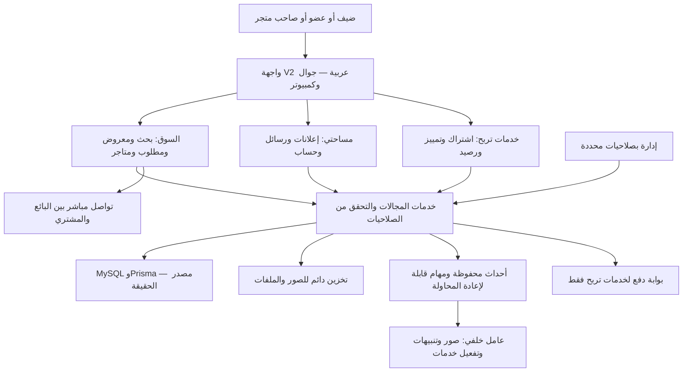
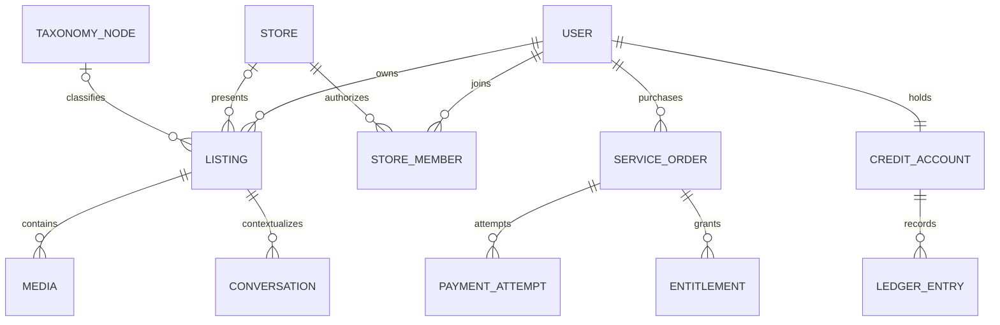
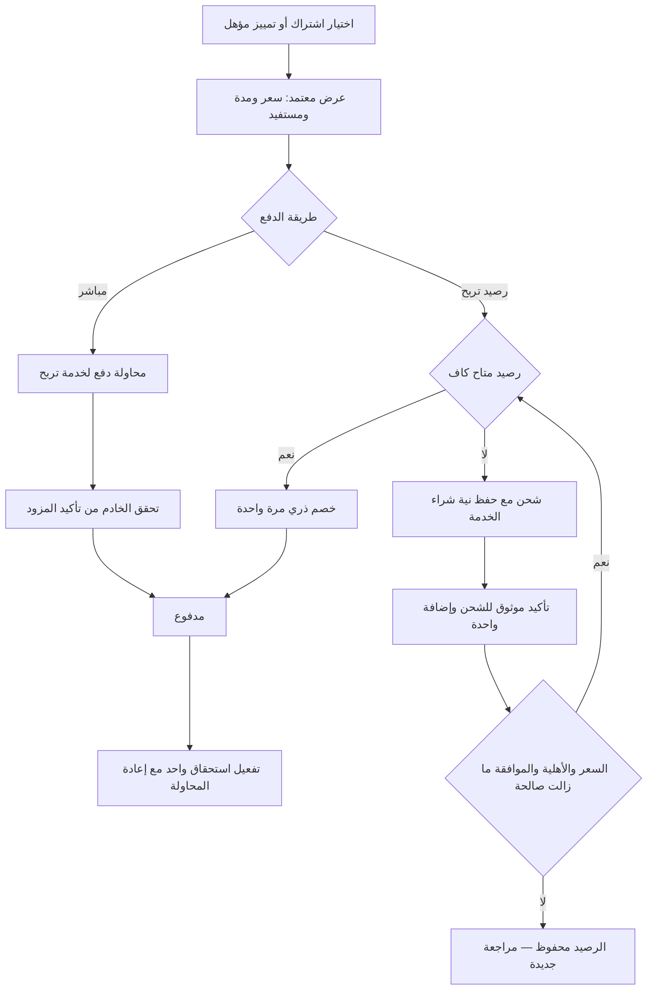

# TRBHH V2 — المعمارية المقترحة للمراجعة

التاريخ: 11 سبتمبر 2026 · الحالة: تصميم قبل التنفيذ · المرجع: موجز المالك المعتمد في هذه المحادثة.

هذه الوثيقة تصف النظام المستهدف. لا تعني أن المزايا الجديدة بُنيت أو أن بيانات الإنتاج رُحّلت. راجع [رحلات المستخدم](02-user-flows.md) و[خطة حفظ البيانات والإطلاق](03-migration-and-release.md).

## 1. القرار المعماري

نطوّر تربح إلى **تطبيق واحد مقسّم إلى مجالات واضحة (Modular Monolith)**: تجربة استخدام V2 جديدة فوق خدمات وبيانات قابلة للتطوير. نحافظ على Next.js وTypeScript وPrisma وMySQL، ونفصل التخزين والدفع والإشعارات والمهام الخلفية خلف واجهات تكامل. لا تتطلب إعادة التصميم إعادة إنشاء المستخدمين أو الإعلانات.

| الخيار | أثره | القرار المقترح |
|---|---|---|
| تغيير ألوان الواجهة القائمة | لا يعالج رحلة النشر والبحث والمتجر والدفع | لا يحقق هدف V2 |
| واجهة وتجربة جديدة مع تطوير المجالات تدريجيًا | يحفظ البيانات ويتيح اختبار كل مسار | الاختيار الموصى به |
| إعادة كتابة شاملة أو Microservices | يزيد حدود التكامل والترحيل والتشغيل قبل إثبات الحاجة | يؤجل حتى تظهر حاجة قابلة للقياس |

**حدود ثابتة:** تربح يصل الأطراف؛ البيع والتفاوض وقيمة السلعة بين الطرفين مباشرة. داخل المنصة يُدفع لاشتراك متجر أو تمييز إعلان فقط. لا سلة منتجات، ولا عمولة، ولا ضمان سلعة، ولا تحصيل لحساب البائع. الخدمات المستقبلية تحتاج اعتمادًا مستقلًا، ولا تُفعّل تلقائيًا بسبب قابلية النظام للتوسع.

## 2. ما وجدناه في النظام الحالي

فُحص المصدر عند الالتزام `6663a7275e8c16ca13c70c1f6682291a9103845b`. هذه حقائق مصدر، وليست إحصاءً جديدًا لقاعدة الإنتاج.

| الموجود | التطوير المطلوب |
|---|---|
| Next.js 16.3 وReact 19 وPrisma 6 وMySQL وRedis | الاحتفاظ بالأساس وتحديث حدود المجالات؛ بعض الأدلة القديمة تصف Next.js 15 |
| جدول إعلانات يدعم العرض والطلب عبر `adsType` | إبراز «مطلوب الآن» ومواصفاته ومطابقته دون فصل تاريخ الإعلانات في قاعدة بديلة |
| حسابات وهويات نشر ومتاجر وموظفو متجر | صلاحيات موحّدة مع سياق واضح: نشر باسمي أو باسم متجر أملك صلاحية إدارته |
| مراسلة ومفضلة وبحث محفوظ وتقييمات | تطوير التجربة وتخزين كل فلاتر البحث وتدقيق مصدر شارات الثقة |
| رصيد وشحن واشتراكات قديمة | فصل شراء خدمة مباشرة عن شحن الرصيد، ومصالحة السجل المالي والاستحقاقات |
| أعمدة تصنيف خاملة وحقول قديمة محفوظة | تصنيفات V2 وشجرة فرعية وربط موثق بالقديم |
| ملفات محلية ومهام تبدأ أثناء عرض بعض الصفحات | تخزين دائم قابل للتبديل وعامل خلفي مستقل عن زيارة الصفحات |

**أولوية المرجع:** قرارات V2 الحالية تتجاوز ما يتعارض معها في `CLAUDE.md` و`docs/PRODUCT-ROADMAP.md`، وبالأخص منع التصنيفات القديم واقتراحات عمولة/دفع منتجات قديمة. لا نعيد مناقشة هذه القرارات.

## 3. مجالات النظام ومسؤولياتها

| المجال | يمتلك | الحد الفاصل |
|---|---|---|
| الحساب والصلاحيات | دخول، ملفات شخصية، هويات نشر، عضويات متاجر، تفضيلات | الشخص نفسه يمكن أن يشتري ويبيع ويدير متجرًا؛ لا حساب دخول جديد لكل دور |
| الإعلانات والتصنيف | معروض ومطلوب، مسودات، خصائص، صور، مكان، مراجعة ونشر | الإعلان ليس طلب شراء؛ التمييز منفصل عن حالة النشر |
| البحث والاكتشاف | بحث عربي، فلاتر، ترتيب، مفضلة، محفوظات، مقارنة | لا يعرض غير المنشور أو المحجوب؛ الفهرس نسخة مشتقة وليس مصدر الحقيقة |
| المتاجر | صفحة عامة، كتالوج، هوية، ساعات عمل، موظفون | ملكية المتجر وصلاحية إدارته منفصلتان عن اشتراكه وتوثيقه |
| خدمات تربح | كتالوج خدمات، أسعار بإصدارات، طلب خدمة، اشتراك، تمييز | نوعا الدخل المعتمدان فقط؛ المنتج المعروض لا يدخل هذا المجال |
| رصيد تربح | حساب رصيد خدمات، شحن، خصم، سجل وتسويات | لا تحويل لأعضاء ولا سحب بنكي ولا استقبال قيمة سلعة |
| التواصل والمطابقة | محادثات، قنوات تواصل، مطلوب/معروض، تنبيهات | اختيار القناة بيد المستخدم؛ لا تفاوض أو إرسال عرض تلقائي نيابة عنه |
| الثقة والمراجعة | أدلة توثيق، تقييمات، بلاغات، حظر، مكافحة سبام | التوثيق يحدد ما تم التحقق منه ولا يضمن السلعة أو الصفقة |
| الإدارة والقياس | إعدادات، صلاحيات، محتوى، سجل تدقيق، تقارير | العمليات المؤثرة تمر بالخدمات نفسها؛ لا تعديل أرصدة أو حالة دفع مباشرة |

صفحات Next.js وServer Actions/Route Handlers تستقبل الطلب وتستدعي خدمة المجال. الخدمة تعيد التحقق من الهوية والملكية والقواعد؛ إخفاء زر في الواجهة لا يُعد صلاحية. معاملات قاعدة البيانات تحمي التغييرات المركّبة، وتُحفظ الأحداث المطلوبة داخل المعاملة نفسها قبل إرسالها للخلفية.

## 4. خريطة الصفحات والتنقل

المسارات التالية **مقترحة**؛ تثبت في مرحلة التنفيذ بعد حصر المسارات القديمة. معرّف الإعلان ثابت حتى لو تغيّر عنوانه.

| الصفحة الأساسية | المسار المستهدف | المحتوى أو الإجراء الأساسي |
|---|---|---|
| الرئيسية | `/` | الشعار والعبارة والبحث ← التصنيفات ← الأحدث ← المميز ← مطلوب الآن ← المتاجر ← افتح متجرك ← الأمان |
| البحث والتصنيف | `/search` و`/market/[category]/[city]` | كلمة، مدينة، تصنيف فرعي، سعر، حالة، صورة، توثيق، ترتيب، فلاتر مناسبة للفئة |
| تفاصيل الإعلان | `/ads/[id]` | معرض وسعر ومواصفات وبائع وثقة وتواصل وإبلاغ ومشابه |
| إضافة إعلان | `/ads/new` | معروض/مطلوب، تصنيف، صور، معلومات، معاينة، نشر |
| المتجر العام | `/store/[handle]` | شعار وغلاف ونبذة وموقع وتواصل وتقييم وكتالوج |
| لوحة البائع | `/seller` | إعلاناتي وأداؤها وحالتها؛ إدارة المتجر في `/seller/store` |
| رصيد تربح | `/account/credit` | الرصيد، الشحن، سجل العمليات، حالة العملية |
| الاشتراكات | `/subscriptions` | مقارنة الباقات، الاستحقاق الحالي، التجديد |
| شراء تمييز | `/ads/[id]/promote` | نوع الظهور والمدة والسعر المتاحان ثم الدفع |
| الرسائل | `/messages` | محادثات مرتبطة بالإعلانات والطلبات مع حظر وإبلاغ |
| الحساب | `/account` | الملف والتوثيق والمفضلة والبحث المحفوظ والتفضيلات والأمان |
| الإدارة | `/admin` | المستخدمون والمتاجر والإعلانات والتصنيفات والخدمات والرصيد والبلاغات والمحتوى والقياس |

إضافة مسارات عملية الدفع `/services/orders/[id]` وحالة الشحن ضمن الحساب تخدم الصفحات السابقة، وليست متجر منتجات أو checkout لسلعة.

على الجوال: **الرئيسية | البحث | + أعلن | الرسائل | حسابي**. في تفاصيل الإعلان، شريط التواصل يأخذ مساحة الإجراء الأساسية ولا يتراكب مع التنقل أو لوحة المفاتيح. في نموذج الإعلان يظهر حفظ/متابعة مع تقدم واضح؛ لا نزاحم إجراء النشر بشريطين ثابتين.

`/store` مستخدم حاليًا للإدارة؛ نقترح تحويله إلى `/seller/store` مع استمرار حماية الدخول. الروابط العامة القديمة `/companies/[id-or-handle]` وروابط منتجات المتجر تُربط بوجهاتها المحددة عبر جدول aliases وتحويل دائم واحد عند الإطلاق، دون تحويل جماعي للصفحة الرئيسية. تُحجز الكلمات النظامية وتُمنع مصادمات handle. تغيير handle يحتفظ بالقديم كاسم بديل للمتجر نفسه.

## 5. نموذج البيانات والعلاقات

الأسماء الجديدة أدناه **أسماء منطقية**، وليست أمرًا بإنشاء جداول مكررة. التنفيذ يربطها بالجداول الحالية أو يوسعها بعد الجرد، خاصة طلبات الخدمات والتقييمات والرصيد.

| المجموعة | الحفظ والإضافات المطلوبة |
|---|---|
| المستخدم والهوية | تبقى IDs وملفات الحساب وروابطه وتواريخ العضوية وhash كلمات المرور؛ عضوية المتجر تمنح صلاحية ولا تنقل ملكية حساب الشخص |
| الإعلان | نفس ID والمالك والتاريخ؛ `intent` معروض/مطلوب، والغرض بيع/إيجار/خدمة/وظيفة بحسب التصنيف؛ خصائص بإصدار تعريف، تاريخ السعر، نسخة تحرير منفصلة عند المراجعة |
| السعر | مبلغ بالهللات أو نطاق ميزانية للمطلوب أو «غير محدد»؛ الصفر لا يعوّض القيمة المجهولة؛ وحدات السعر مثل شهري/يومي حسب الفئة |
| التصنيف | شجرة V2 وعلاقات أب/ابن، slug، ترتيب وحالة، تعريف حقول وفلاتر، خريطة من القديم إلى الجديد مع مصدر وثقة المراجعة |
| الصور | ID ومالك ومرجع أصل وترتيب وبصمة ومقاسات مشتقة؛ أصول الإعلانات العامة منفصلة عن إثباتات الهوية والإيصالات الخاصة |
| المتجر | IDs والمالك وروابط الإعلان والتقييم، handle وaliases، عضويات وصلاحيات؛ الإعلان المرتبط بالمتجر لا يُنسخ كمنتج جديد |
| خدمات تربح | كتالوج خدمة، إصدار سعر وحدود ومدة، طلب خدمة يثبت لقطة ما اشتراه المستخدم، محاولات دفع وأحداث مزود |
| الاستحقاقات | اشتراك متجر، تمييز مرتبط بإعلان، وقت بداية ونهاية، مصدر مدفوع/منحة/ترحيل موثق؛ سجل تدقيق لتغييراتها |
| الرصيد | سجل حركات غير قابل للتحرير المباشر، مبلغ صحيح بالهللات، مرجع العملية ومفتاح منع التكرار؛ تصحيح الخطأ بحركة مقابلة موثقة |
| الاكتشاف والتواصل | محفوظات بحث بفلاتر وإصدار، مفضلة، مشاهدات حديثة، محادثات، تفضيلات تنبيه، أحداث مطابقة وتسليم قابلة لمنع التكرار |
| الثقة | نوع التوثيق وحالته ومصدره ومدته ومرجع دليل خاص؛ التقييم يحفظ كاتبه وسياقه ومصدر أي وصف للتعامل |

التصنيفات الأولية المعتمدة: عقارات، سيارات، معدات وآليات، مواشي وزراعة، إلكترونيات، منزل وأثاث، خدمات، شركات وموردون، وظائف، أخرى. تدعم تصنيفات فرعية؛ لا نفرض «جديد/مستعمل» أو صور سلعة على وظيفة أو خدمة لا ينطبق عليها الحقل. الإعلان القديم مجهول الحالة أو التصنيف يبقى مجهولًا حتى تصحيحه؛ لا نخمن ولا نخفيه لمجرد نقص معلومة جديدة.

## 6. دورات الحالة

**الإعلان:** نفصل ثلاثة محاور كي لا تختلط صلاحيات العرض بسبب حالة واحدة:

- التحرير والمراجعة: مسودة ← مقدم للمراجعة ← مقبول / يحتاج تعديل / مرفوض.
- العرض: منشور / موقوف من صاحبه / منتهي / مؤرشف، مع حجب إداري مستقل له سبب وسجل.
- التوفر: متاح / تم البيع / لم يعد متاحًا، أو مطلوب مفتوح / تم العثور عليه / سُحب الطلب.

الخدمة تحسب أهلية الظهور من هذه المحاور. النسخة المنشورة لا تُستبدل بتعديل غير مقبول. التمييز لا يسمح بعرض إعلان محجوب أو منتهٍ، ولا يغيّر وقت نشره عضويًا. إنهاء العرض يحفظ السجل والصور؛ إعادة النشر تمر بقواعد التحقق الحالية.

**المتجر:** مسودة → مراجعة عند الحاجة → معتمد قابل للنشر / يحتاج تعديل / موقوف. **الاشتراك:** غير موجود → نشط → منتهٍ، وفترة سماح فقط إذا اعتمدت. قرب التجديد تنبيه مشتق من التاريخ. الدفع والاعتماد والتوثيق ثلاث حالات مستقلة؛ تُراجع أهلية المتجر قبل تحصيل اشتراكه.

عند انتهاء اشتراك أو خفض باقة تبقى البيانات والإعلانات والتقييمات. قبل التنفيذ يجب اعتماد قواعد الظهور وحدود الإضافة عند التجاوز؛ لا حذف تلقائي ولا إلغاء فترة مدفوعة قديمة. التجديد التلقائي لا يُفعّل بلا موافقة مستقلة ووسيلة تدعمه؛ التصميم يعمل بالتجديد اليدوي والتذكير أولًا.

## 7. شراء خدمات تربح والرصيد

**مصدر السعر هو الخادم:** يعرض اسم الخدمة والمدة والمزايا والإجمالي وكل مكوّنات السعر الفعلية من إعدادات معتمدة. لا أرقام افتراضية قابلة للشراء. يخزن طلب الخدمة لقطة ثابتة للسعر والاستحقاق والمالك المستفيد ومن يدفع.

ضوابط العقد المالي التقني:

1. الدفع المباشر له غرض `service_order`؛ الشحن غرضه `credit_topup`. شراء الخدمة المباشر لا يزيد الرصيد ولا ينشئ شحنًا وهميًا.
2. الأسعار والأرصدة بالهللات الصحيحة وبعملة واضحة. يفحص الخادم المبلغ والعملة ومرجع الطلب والمستفيد وبيئة المزود، لا يأخذها من المتصفح كحقائق.
3. التحقق من إشعار المزود وتوقيعه أو استعلام موثوق يتم على الخادم. العودة من بوابة الدفع ليست دليل نجاح. الأحداث المتكررة والمتأخرة تُحفظ وتُعالج دون إنقاص حالة نهائية بسبب حدث قديم.
4. خصم الرصيد وحركة السجل وتأكيد طلب الخدمة وأمر التفعيل تُحفظ في معاملة واحدة بقفل/تحديث شرطي مناسب. الرصيد المتاح لا يصبح سالبًا؛ معاملتان متزامنتان لا تنفقان المبلغ نفسه.
5. التفعيل الخلفي له مفتاح فريد مرتبط بطلب الخدمة. وصول الدفعة وفشل التفعيل ينتجان «مدفوع — جارٍ التفعيل» وإعادة محاولة، وليس إعادة دفع.
6. لكل طلب شراء ومحاولة دفع وشحن وحدث مزود واستحقاق مفاتيح مناسبة لمنع التكرار. الانقطاع أو إعادة تحميل الصفحة يعيدان الحالة المحفوظة. التطبيق لا يعد بأن الشبكة تسلّم الأحداث مرة واحدة؛ يحمي الأثر المحاسبي من التكرار.
7. «اشحن وأكمل» يحتاج موافقة ظاهرة تشمل الخدمة والسعر. بعد تأكيد الشحن تُفحص صلاحية العرض والأهلية والسعة مجددًا. إن تغيّرت، يبقى الرصيد محفوظًا وتظهر مراجعة جديدة قبل الخصم.
8. التمييز يعرض موقع الظهور والمدة والسعر؛ التثبيت والواجهة لهما سعة وحجز مؤقت إن كانت المساحة محدودة. لا نبيع موضعًا غير متاح. يبدأ الاستحقاق عند الموعد المبين بعد أهلية النشر؛ تعثر التفعيل يدخل معالجة موثقة، ويحتاج قرار استرجاع/تعويض خدمة معتمد قبل الإطلاق المدفوع.
9. إعادة محاولة دفع لطلب معلق تتطلب استعلام حالته أولًا. إذا أكد المزود دفعتين مختلفتين للطلب نفسه، يُمنح الاستحقاق مرة واحدة وتُسجّل الزيادة كاستثناء مالي للتسوية؛ لا تختفي ولا تتحول لإيراد ثانٍ بصمت.
10. تسوية خدمة أو إلغاء دفعة يعالجان بسجل مع مرجع الأصل وصلاحية وسبب. لا يوجد زر «تعديل الرصيد» يكتب رقمًا بلا حركة مقابلة، ولا وعد الآن بسياسة استرجاع غير معتمدة.

سجل الشحن والدفع والاستحقاق مترابط وقابل للتتبع. موظف المتجر لا ينفق الرصيد الشخصي للمالك لمجرد قدرته على تعديل إعلان؛ صلاحية الشراء وهوية الدافع صريحتان.

## 8. البحث و«مطلوب الآن» والثقة

يبدأ البحث بخدمة موحدة فوق MySQL وفهارس مناسبة، مع تطبيع عربي للكلمات وأسماء المدن ومرادفات مضبوطة. تحفظ قيم الفلاتر في الرابط وتُستعاد عند الرجوع. نُجري قياس جودة البحث قبل اختيار محرك خارجي؛ قابلية استبدال التنفيذ جزء من التصميم وليست شراء مزود جديد الآن.

مطابقة المطلوب والمعروض تستخدم النوع المقابل والتصنيف والمواصفات والمدينة أو نطاق المسافة والميزانية حيث تنطبق. تعرض سببًا مفهومًا مثل «نفس التصنيف والمدينة». لا نرسل تنبيهًا على تشابه كلمات ضعيف وحده. نبدأ بالاقتراحات داخل الموقع، ثم تنبيهات اختيارية ذات تكرار وحدود وتجميع، وإلغاء اشتراك واضح. كل حدث يربط المستخدم والإعلان والبحث/الطلب لمنع تكراره. إغلاق مطلوب أو حجب إعلان يوقف تنبيهاته الجديدة.

المراسلة الداخلية وواتساب والاتصال هي أساس التصميم للقنوات المتاحة حاليًا؛ يتحكم المعلن بما يعرضه. الرسائل محفوظة في MySQL؛ تحديثها يستخدم القناة المتاحة بعد اختبارها في بيئة النشر، مع استطلاع قصير قابل للتدرج كخيار توافق. لا نعتمد اتصالًا دائمًا داخل عملية قد تتوقف دون اختبار دعم البيئة. الحظر يمنع التواصل الداخلي والتنبيهات بين الحسابين؛ لا يمكن لتربح منع تواصل خارجي جرى خارج المنصة.

التوثيق يعرض «الجوال موثق» أو «الهوية موثقة» أو «منشأة موثقة» بحسب الدليل الفعلي. اشتراك المتجر ليس توثيقًا. التقييمات القديمة تبقى، لكن أي علامة «تعامل موثق» مأخوذة من اختيار المستخدم وحده لا تُنقل كإثبات مستقل. تُحفظ provenance وتظهر تسمية تصف مصدرها. الرسالة أو نقرة واتساب أو إقرار «تم البيع» لا يثبت دفعًا أو شراءً.

## 9. التشغيل والعزل وVercel Preview

| البيئة | بياناتها وتكاملاتها | طريقة استخدامها |
|---|---|---|
| التطوير المحلي | مصطنعة، أسرار تطوير، دفع وإرسال وهميان | بناء واختبارات دون اتصال بقاعدة الإنتاج |
| Vercel Preview | MySQL وتخزين وRedis مستقلون، أسرار جلسات ومزود Sandbox منفصلة | مراجعة الجوال والكمبيوتر ورحلات V2 |
| تمرين الترحيل الخاص | نسخة مصرح بها ومنزوعة الحساسية قدر الإمكان، وصول مقيد، لا إرسال خارجي | تجربة المطابقة والاستعادة والقطع بعيدًا عن Preview العامة |
| Production | الموارد الحالية على VPS إلى أن يُعتمد خلاف ذلك | لا تغيير في هذه المرحلة |

Vercel يسمح بفصل متغيرات البيئة وتخصيصها للفروع؛ هذا لا يعزل قاعدة البيانات تلقائيًا. التصميم يشترط موارد واعتمادات مستقلة، ويفشل تشغيل المعاينة إذا كانت قاعدة البيانات أو حاوية الملفات ضمن أهداف الإنتاج. لا fallback إلى أسرار الإنتاج. [مرجع متغيرات الفروع](https://vercel.com/docs/environment-variables/manage-across-environments).

يُفعّل منع الفهرسة وحماية الوصول الملائمة للمعاينة، ويُختبران على الرابط الفعلي، وليس على الإعدادات وحدها. لا نضع بيانات خاصة في رابط عام؛ حماية النشر طبقة إضافية لا تعوّض صلاحيات التطبيق. [مرجع حماية النشر](https://vercel.com/docs/deployment-protection).

نحتاج قبل أول Preview تطبيقي إلى حل الفجوات التالية:

- **الصور:** النقل من `fs.writeFile` إلى واجهة تخزين دائم. الرفع المباشر يستخدم تصريحًا قصير العمر مرتبطًا بالحساب والمسودة؛ يتحقق الخادم من المحتوى والحجم والملكية، ويؤكد اكتمال الأصل قبل النشر. مساحة وظائف Vercel المحلية ليست مخزن صور دائمًا. [مرجع Runtime](https://vercel.com/docs/functions/runtimes).
- **اتصالات MySQL:** ميزانية اتصالات واختبار حمل يناسب Prisma والإصدار المستخدم، لا نسخ حجم pool الحالي لكل نسخة تلقائيًا. [مرجع إدارة الاتصالات](https://vercel.com/kb/guide/connection-pooling-with-functions).
- **الترحيل:** مهمة migrations محددة وصلاحية منفصلة؛ تطبيق المعاينة لا ينفذ DDL عند الإقلاع. لا صلاحية لتعديل مخطط الإنتاج من Preview.
- **المهام:** نقل التذكير والتجديد والمعالجة من عرض الصفحات إلى outbox وعامل خلفي مستقل بمفاتيح منع التكرار وأقفال واستئناف. تُختبر المهام على Preview بمحفّز اختبار مصرح به، ولا نفترض نجاحها لأن الصفحة تعمل. تكرار أو تداخل المهام ممكن ويجب تصميمه. [مرجع تزامن المهام](https://vercel.com/docs/cron-jobs/manage-cron-jobs).
- **Redis:** لا تعتمد حدود تسجيل الدخول أو النشر والدفع الحساسة على ذاكرة instance محلية. عند تعطل المورد المشترك نستخدم مسارًا محافظًا أو بديلًا متينًا؛ لا نفتح الحدود بلا حماية.

لا يلزم اختيار مورد جديد أو نقل استضافة الإنتاج أثناء اعتماد هذه المعمارية. تحديد مورد الصور والمهام وقاعدة Preview خطوة إعداد قبل التنفيذ، مع توثيق التكلفة والمنطقة والاعتمادات وقتها.

## 10. الخصوصية والأمان والأداء

التحقق من ملكية الإعلان والمتجر والمحادثة والعملية المالية على كل قراءة/كتابة خاصة. صلاحيات الإدارة على مستوى الإجراء، مع تدقيق خاص بالحظر والتوثيق وتعديل الباقات والتسوية. حفظ الأدلة والإيصالات في تخزين خاص بروابط محدودة العمر، وتنقية سجلات الأخطاء من الأسرار والنصوص الخاصة وبيانات الدفع. لا تخزن تربح بيانات البطاقة الخام.

تُفحص الصور والنصوص وروابط الإعلانات، وتُحد محاولات النشر والرسائل والبلاغات. للمكررات والسبام مسار مراجعة قابل للتفسير، لا حذف آلي يضيع بيانات البائع. سبب الحجب وإمكانية التصحيح أو الاعتراض يظهران لصاحب المحتوى. يلزم تفعيل MFA لأدوار الإدارة الحساسة ضمن التنفيذ.

التصفح العام يستفيد من عرض الخادم، صور WebP/AVIF بأحجام مناسبة، تحميل كسول أسفل الصفحة، أبعاد ثابتة للصور، وCache حسب التصنيف/المدينة. لا تخزين مشترك للرسائل والأرصدة والصفحات الشخصية. أحداث النشر/الحجب/تغير السعر تُبطل cache والفهرس المناسبين حتى لا تبقى إعلانات ممنوعة أو أسعار قديمة في النتائج.

SEO يعتمد صفحات تصنيف ومدينة ذات محتوى كافٍ، Metadata وCanonical وSitemap وSchema يصف نوع الإعلان فعلًا؛ لا نفرض Product على وظيفة أو طلب شراء. مجموعات الفلاتر العشوائية لا تولّد نسخًا مفهرسة بلا حدود. الصفحة تعرض عنوان المعلن الطبيعي، ولا تضيف كلمات SEO متراكمة إلى البطاقة.

أهداف اختبار أولية وليست قياسات محققة: LCP ≤ 2.5 ثانية، INP ≤ 200ms، CLS ≤ 0.1 عند الشريحة 75 على الجوال. تُقاس بيانات ميدانية عندما تتاح وتُفصل عن المختبر. WCAG 2.2 AA هدف قبول للتباين والتركيز والنماذج وإتاحة الحركة؛ نتحقق بالاختبار قبل ادعاء المطابقة. [مقاييس Web Vitals](https://web.dev/articles/vitals)، [WCAG 2.2](https://www.w3.org/TR/WCAG22/).

مؤشرات المنتج: وصول البحث لإعلان ثم تواصل، نسبة البحث بلا نتائج، اكتمال النشر ووقت إكماله، زمن أول رد داخلي، الطلبات التي تلقت تواصلًا، عودة المستخدم، تجديد المتجر وتفعيل التمييز. تفصل نقرات الاتصال/واتساب عن مكالمة فعلية، ولا نعلن GMV أو عدد صفقات مثبتًا من هذه الأحداث. لا تسجيل لمحتوى خاص بغرض التحليلات، ومعدل الرد يوضح نافذته وعينته.

## 11. تسليم المرحلة التالية

بعد مراجعة المعمارية والرحلات: نظام تصميم مبني على [الشعار المرفق المعتمد](assets/approved-logo-reference.jpg)، ثم Wireframes للرئيسية والإعلان والنشر والمتجر ولوحة البائع، ثم مراجعتها قبل التنفيذ الكامل. المرجع الحالي صورة ثلاثية الأبعاد؛ لا نعتبر الشعار القديم في `public` مرجع V2.

اتجاه التصميم ثابت: فحمي/كحلي شديد الداكن وذهبي من الشعار، سوق فاتح وأوف وايت، نصوص ثانوية رمادية، RTL وMobile First. **بيع. اشترِ. وتربح.** ثم **اعرض اللي عندك، واكتشف اللي تحتاجه، وتواصل مباشرة.** نسخة 2D والألوان الدقيقة والتباين ومقاسات المكونات تُجهز في نظام التصميم؛ لا تغيير لاتجاه الهوية.

القرارات المتبقية قبل تفعيل البيع المدفوع: أسعار وحدود الباقات، مدد وأسعار وسعة التمييز، سياسة انتهاء الاشتراك/السماح، وسياسة معالجة خدمة مدفوعة تعذر تنفيذها. هذه مدخلات إعداد معلنة في الموجز وليست مبررًا لإيقاف تصميم الصفحات. AI مساعد الإعلانات والمطابقة المتقدمة والإشعارات الموسعة مراحل لاحقة؛ لا تطبيق أصلي الآن ولا تسعير آلي للسلع.

## 12. أدلة المصدر المحلي

روابط لأجزاء فُحصت لتحديد نقاط التطوير، وليست ملفات عُدلت ضمن هذا التسليم:

- [التقنيات](../../package.json) و[المخطط](../../prisma/schema.prisma).
- [تخزين الملفات](../../src/lib/storage.ts)، [اتصال Prisma](../../src/lib/prisma.ts)، [الإقلاع](../../src/instrumentation.ts).
- [إدارة المتجر الحالية](../../src/app/store/layout.tsx)، [المتجر العام الحالي](../../src/app/companies/[id]/page.tsx).
- [البحث المحفوظ](../../src/lib/saved-search.ts)، [التقييمات](../../src/app/ads/review-actions.ts).
- [مقاصد الدفع الحالية](../../src/lib/payments/types.ts)، [ترحيل مبالغ الرصيد](../../src/lib/wallet-money-migration.ts).

وجود جداول سحب أو حسابات بنكية في المخطط لا يثبت أن سحب الأرصدة خدمة حية. يُحصر ما فيها إن وجد، وتحفظ الالتزامات والتاريخ دون تحويل مبالغ مجهولة المصدر إلى رصيد خدمات مقيد بصمت.
