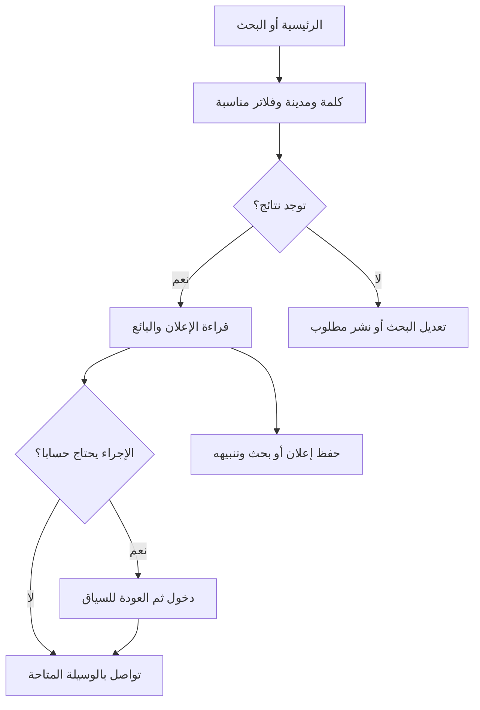
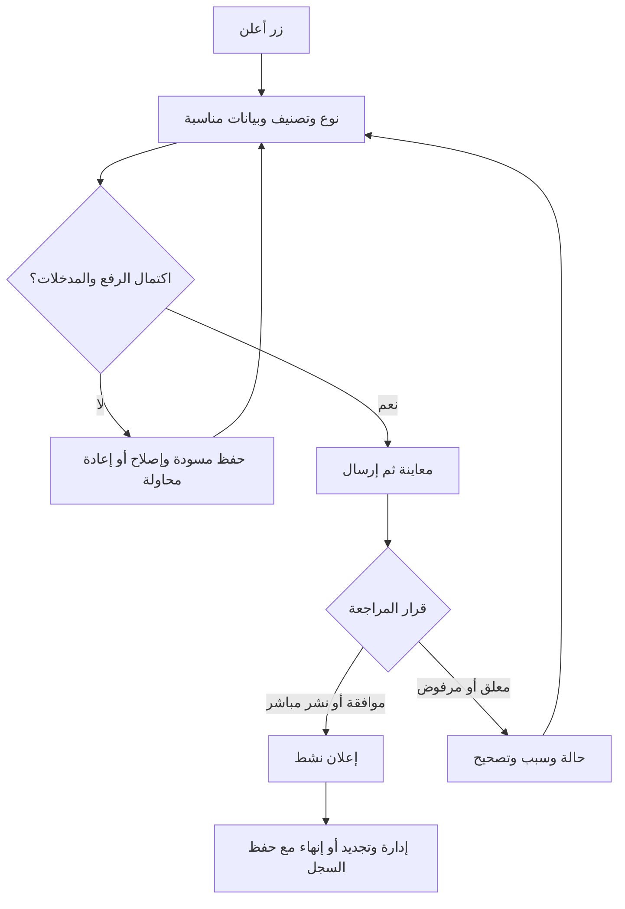
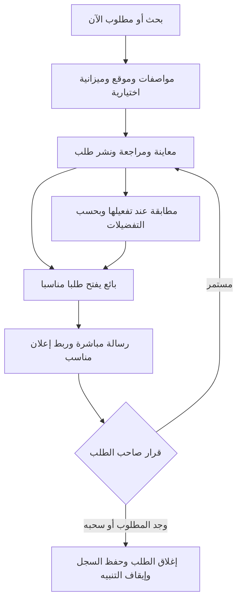
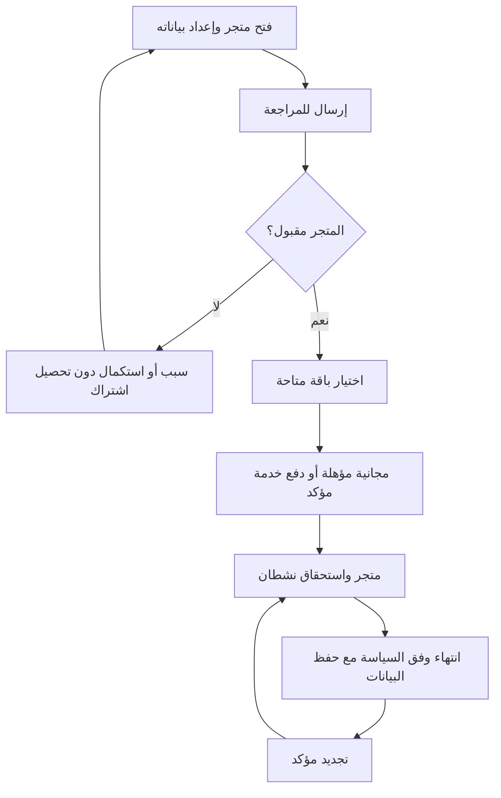
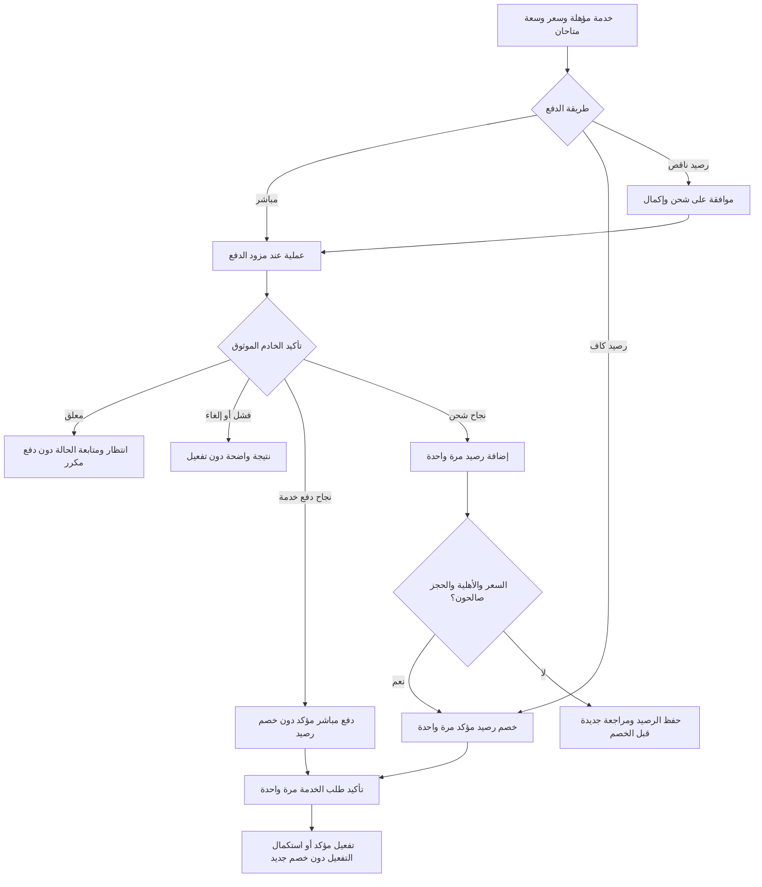
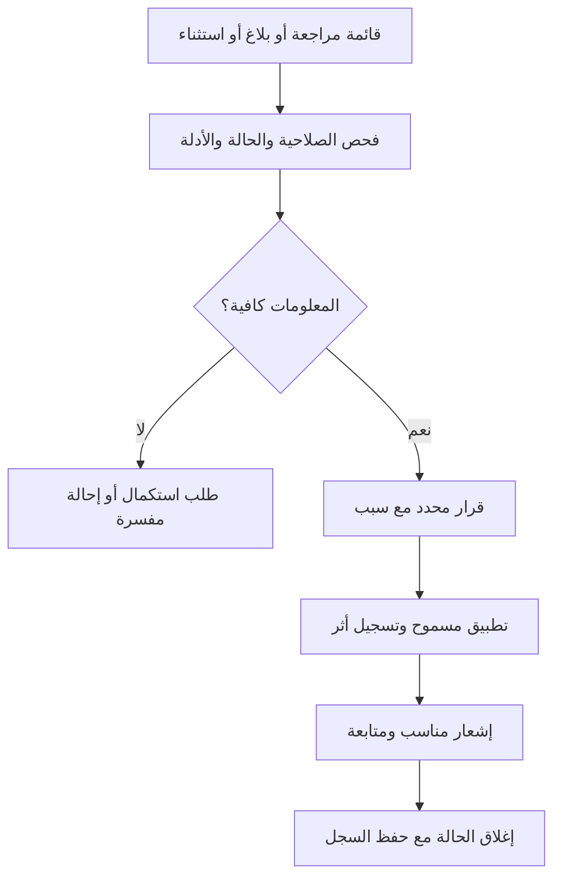

# تربح V2 — رحلات المستخدم

**الحالة: تصميم مقترح للمراجعة، وليس تنفيذًا أو إذنًا بالنشر.**

تعرض هذه الوثيقة عشر رحلات للمشتري والبائع الفرد وصاحب المتجر والمشرف. قرارات المستخدم المعتمدة هي المرجع: تربح منصة سعودية للتواصل المباشر، ولا تكون طرفًا في صفقة السلعة، ولا تحصل قيمتها أو عمولة أو سعيًا عليها. المدفوعات هنا مقابل اشتراكات المتاجر والإعلانات المميزة فقط؛ وأي خدمة مستقبلية تحتاج اعتمادًا قبل إضافتها.

التوثيق في هذه الرحلات يعتمد على دليل أو تحقق فعلي مسجل وقابل للمراجعة. لا يستطيع المستخدم منح نفسه شارة موثوق باختيار مربع في نموذج، ولا يعني توثيق الحساب ضمان السلعة أو الصفقة. الأسعار والمدد وحدود الباقات وسياسة الاشتراك المنتهي ليست محددة في هذه الوثيقة.

## قواعد مشتركة

- تبدأ التجربة بالجوال وتعمل على الكمبيوتر. التنقل السفلي المقترح: **الرئيسية | البحث | + أعلن | الرسائل | حسابي**؛ زر الإعلان واضح في المنتصف.
- التصفح والبحث وقراءة الإعلان متاحة للضيف. عند إجراء يحتاج حسابًا، يحتفظ النظام بسياق المستخدم ثم يعيده إليه بعد الدخول، مع تجنب تنفيذ إجراء مدفوع دون تأكيده.
- تظهر حالات التحميل والفراغ والخطأ وإعادة المحاولة داخل الصفحة. تعثر صورة أو اتصال لا يمسح مسودة مكتوبة.
- تختلف حقول الإعلان بحسب نوعه وتصنيفه. «جديد / مستعمل» مناسب للسلع، ولا يُفرض على خدمة أو وظيفة. السعر قد يكون سعر بيع أو أجرة أو ميزانية طلب أو غير منطبق؛ لا يُعرض غير المحدد كأنه صفر.
- يعمل البحث وفق التصنيفات والتصنيفات الفرعية الجديدة المعتمدة لـ V2؛ إعادة استخدام بيانات التصنيف القديمة مشروطة بمراجعة ترحيلها، ولا يفترض تطابقها تلقائيًا مع التصنيفات الجديدة.
- الإحصاءات تصف الحدث الذي قيس فعلًا: نقرة اتصال أو واتساب ليست مكالمة مكتملة أو صفقة. اختيار «تم البيع» تصريح من صاحب الإعلان، وليس إثبات تحصيل لدى تربح.
- الإنهاء أو الحجب أو انتهاء الاشتراك لا ينشئ حذفًا تلقائيًا لبيانات الحساب والإعلان والمتجر. الحذف، إن طلبه صاحب البيانات أو لزم وفق سياسة معتمدة، مسار مستقل عن هذه الحالات.

## ربط الصفحات الاثنتي عشرة بالرحلات

| الصفحة | الرحلات الأساسية | الإجراء الرئيسي |
| --- | --- | --- |
| 1. الصفحة الرئيسية | ر1، ر6، ر7 | بحث أو تصفح أو إضافة إعلان |
| 2. نتائج البحث والتصنيف | ر1، ر3، ر6 | تضييق النتائج وفتح إعلان أو حفظ البحث |
| 3. تفاصيل الإعلان | ر2، ر3، ر5، ر6 | تواصل أو حفظ أو إبلاغ |
| 4. إضافة إعلان | ر4، ر6 | مسودة ثم معاينة ونشر |
| 5. صفحة المتجر | ر2، ر7 | تصفح الإعلانات والتواصل مع النشاط |
| 6. لوحة البائع | ر4، ر5، ر6، ر7 | إدارة الإعلانات والمتجر ومتابعة النتائج |
| 7. رصيد تربح | ر8، ر9 | رصيد وسجل عمليات وشحن |
| 8. الاشتراكات | ر7، ر8 | مقارنة الباقات والتجديد وإدارة الاستحقاق |
| 9. شراء إعلان مميز | ر5، ر8، ر9 | اختيار ظهور متاح ومراجعة مدته وتكلفته |
| 10. الرسائل | ر2، ر6 | تواصل مباشر داخل تربح |
| 11. الحساب | ر3، ر4، ر7، ر9 | دخول وبيانات وتوثيق وتفضيلات وتنبيهات |
| 12. لوحة الإدارة | ر10 | مراجعة المحتوى والثقة والخدمات والعمليات |

مسارات الصفحات والروابط النهائية تُحسم في وثيقة البنية وخطة تحويل الروابط القديمة. رابط المتجر المقترح في V2 هو `/store/...`، مع حفظ الوصول إلى روابط المتاجر الحالية أثناء الانتقال.

## ر1 — المشتري يبحث عن إعلان مناسب

**البداية:** ضيف أو عضو يفتح الرئيسية أو رابط نتائج بحث.

**المسار الأساسي:**

1. يكتب كلمة البحث ويحدد المدينة؛ ويستطيع البدء بالتصفح دون كتابة كلمة.
2. يرى النتائج مع عددها وحالة الفلاتر المفعلة.
3. يفتح الفلاتر لاختيار التصنيف والتصنيف الفرعي والسعر والحالة والخيارات المناسبة للفئة.
4. يرتب حسب الأحدث أو السعر، أو القرب عند توفر موقع صالح.
5. يفتح الإعلان، ثم يستطيع العودة إلى موضعه السابق في النتائج.

**بدائل وحالات:**

- لا توجد نتائج: اقتراح إزالة فلتر أو توسيع النطاق، ثم خيار «انشر مطلوب» مع نقل المدخلات المناسبة للمراجعة.
- استخدام المسافة: طلب الموقع عند اختيار هذا الخيار فقط؛ عند الرفض يبقى اختيار المدينة يدويًا متاحًا.
- فلاتر لا تنطبق على التصنيف: تُخفى أو تزال بوضوح؛ لا تُستخدم سرًا لتصفية النتائج.
- تعثر جلب النتائج: تبقى الكلمة والفلاتر مع زر إعادة المحاولة.

**معايير القبول:**

- البحث لا يتطلب دخولًا؛ مشاركة رابط النتائج تعيد الفلاتر القابلة للمشاركة.
- لا يُعرض «الأقرب» دون نقطة مرجعية، ولا تُخترع مسافة لإعلان بلا موقع دقيق.
- اختيار «بائع موثق» يرتبط بنوع تحقق مُعرّف ودليل صالح؛ لا يُفسّر الاشتراك المدفوع على أنه توثيق.
- العودة من التفاصيل تحفظ الفلاتر وموضع التصفح بقدر ما تسمح به حالة النتائج الحالية.
- يظهر الإعلان المدفوع بوسم واضح، منفصل عن درجة صلته بالبحث.

## ر2 — المشتري يقرأ الإعلان ويتواصل

**البداية:** فتح إعلان أو منتج في متجر.

**المسار الأساسي:**

1. يشاهد الصور والعنوان والسعر ووحدته والحالة والموقع وتاريخ الإعلان.
2. يقرأ المواصفات والوصف وبيانات البائع والتقييمات وتاريخ العضوية وأنواع التوثيق المتحققة.
3. يرى إرشادات الأمان في موضع واضح دون إعاقة قراءة الإعلان.
4. يختار مراسلة داخل تربح أو واتساب أو اتصال، بحسب ما أتاحه صاحب الإعلان.
5. يتفاوض مع البائع مباشرة؛ لا ينتقل إلى تحصيل قيمة السلعة داخل تربح.

**بدائل وحالات:**

- المراسلة الداخلية تحتاج دخولًا: بعد الدخول يُفتح سياق المحادثة مع البائع والإعلان المقصود، دون إرسال رسالة تلقائية باسم المستخدم.
- الإعلان لم يعد متاحًا: تظهر حالته الحالية وتاريخ تحديثها، مع روابط مناسبة لإعلانات أخرى؛ لا يظهر كإعلان نشط.
- وسيلة التواصل غير متاحة: لا يظهر زر فارغ أو رابط غير صالح.
- يريد المستخدم الإبلاغ: يختار السبب ويضيف توضيحًا أو دليلًا عند الحاجة، ثم يتلقى تأكيد استلام البلاغ دون وعد بنتيجته.
- يريد الحظر: يُشرح أثر الحظر على التواصل قبل تأكيده، مع إمكانية إدارته من الحساب.

**معايير القبول:**

- شريط الجوال يعرض الوسائل المتاحة فقط، ولا يحجب آخر المحتوى أو يتداخل مع لوحة المفاتيح.
- لا يوجد زر شراء للسلعة أو ضمان صفقة أو تحويل عبر رصيد تربح.
- شارة كل توثيق تسمي ما تحقق فعليًا، ولا يثبت تاريخ العضوية أو عدد الإعلانات جودة السلعة.
- ضغط رابط اتصال أو واتساب يسجل نقرة فقط؛ وعدد الرسائل لا يُعرض كعدد صفقات.
- لا تظهر شارة «شراء مثبت» أو «تعامل موثق» بناءً على اختيار المستخدم وحده؛ التقييمات القديمة تُحفظ، وتُراجع دلالة وسومها أثناء الترحيل.

## ر3 — المشتري يحفظ ويتابع

**البداية:** إعلان مهم أو مجموعة نتائج يريد المستخدم متابعتها.

**المسار الأساسي:**

1. يختار حفظ الإعلان أو حفظ البحث.
2. يسجل دخوله عند الحاجة ويعود إلى الاختيار نفسه؛ ثم يرى تأكيد الحفظ.
3. للبحث: يحفظ الكلمة والمدينة والتصنيف ونطاق السعر والحالة والفلاتر الأخرى المستخدمة، ويسميه اختياريًا.
4. يختار التنبيهات المطلوبة وقناتها وتكرارها من الخيارات المتاحة، مثل إعلان مطابق أو تغير سعر إعلان محفوظ.
5. يفتح التنبيه لاحقًا ليصل إلى الإعلان أو نتائج البحث الحالية.

**بدائل وحالات:**

- لا يرغب في التنبيهات: يبقى الحفظ متاحًا دون اشتراط الموافقة.
- رفض إشعارات المتصفح: تُحفظ تفضيلات الحساب ويظهر بديل متاح دون تكرار طلب الإذن بإزعاج.
- إزالة إعلان من المفضلة: يُوضح أثر ذلك على تنبيه سعره ويُسمح بإدارة التنبيه المرتبط به.
- التنبيه مرتبط بإعلان منتهٍ أو محجوب: تُعرض الحالة المناسبة؛ لا يُعاد إظهار محتوى لا يحق للمستخدم رؤيته.
- «شوهد مؤخرًا» ميزة منفصلة عن المفضلة؛ يُتاح مسح سجله وفق سياسة الخصوصية المعتمدة.

**معايير القبول:**

- لا يُطلب إذن إشعارات الجهاز عند أول زيارة؛ يُطلب بعد اختيار المستخدم تفعيلها.
- لكل تنبيه وسيلة واضحة للإيقاف أو تعديل التفضيلات.
- لا يُرسل الحدث نفسه مرتين نتيجة إعادة المعالجة، ولا تُستخدم البيانات لإرسال رسائل خارج الموافقة المحددة.
- تغير السعر يُعرض كمعلومة، لا بوصفه «أفضل صفقة» أو توصية مضمونة.
- المقارنة، عند إضافتها، تُتاح للفئات ذات المواصفات القابلة للمقارنة ولا تُفرض على الخدمات والوظائف.

## ر4 — البائع الفرد ينشر إعلانًا مجانيًا

**البداية:** زر «+ أعلن» من أي صفحة مناسبة.

**المسار الأساسي:**

1. يختار «معروض» أو «مطلوب»، ثم التصنيف والتصنيف الفرعي.
2. يسجل دخوله عند الحاجة مع حفظ الخيارات التي بدأ بها.
3. يضيف الصور ثم العنوان والوصف.
4. يحدد السعر أو الأجرة ووحدة التسعير إن انطبقت، ثم حالة السلعة إن انطبقت.
5. يحدد الموقع وحقول التصنيف ووسائل التواصل المسموح بعرضها.
6. يراجع المعاينة ويعدل أي قسم مباشرة.
7. يرسل الإعلان، فيرى حالته الفعلية: منشور أو قيد المراجعة.
8. بعد النشر يظهر اقتراح اختياري وغير معيق لتمييز الإعلان.

**بدائل وحالات:**

- يريد الإكمال لاحقًا: يحفظ مسودة مرتبطة بحسابه ويعود إليها من لوحة البائع.
- فشل رفع صورة: تبقى الصور الناجحة والمدخلات؛ يعيد محاولة الصورة المتعثرة أو يزيلها.
- انقطعت الشبكة أثناء الإرسال: تظهر حالة تحقق من النشر قبل السماح بمحاولة قد تنشئ نسخة ثانية.
- إعلان خدمة أو وظيفة أو مطلوب: تظهر الحقول المناسبة؛ لا يُفرض سعر بيع أو «جديد / مستعمل» أو صور سلع على نوع لا يناسبه ذلك.
- يحتاج الإعلان مراجعة: يُشرح أنه لم يصبح ظاهرًا للجمهور بعد، مع رابط متابعة الحالة.

**معايير القبول:**

- النشر الأساسي للمستخدم العادي مجاني ولا يتوقف على شراء اشتراك أو تمييز.
- المدخلات الصحيحة لا تضيع عند خطأ في حقل آخر أو فشل صورة.
- الإرسال المتكرر لا ينتج إعلانات متعددة للطلب نفسه.
- المسودة خاصة بصاحبها؛ والمعاينة لا تجعلها منشورة.
- لا يغير النظام العنوان أو الوصف أو التصنيف المقترح آليًا دون مراجعة صاحب الإعلان واعتماده.

## ر5 — البائع يدير الإعلان وينهيه

**البداية:** لوحة البائع ثم «إعلاناتي».

**المسار الأساسي:**

1. يراجع قائمة إعلاناته حسب الحالة: مسودة، قيد المراجعة، نشط، مرفوض، منتهٍ، أو مغلق من صاحبه.
2. يفتح الإعلان لرؤية المشاهدات والمفضلة والرسائل ونقرات التواصل، متى توفرت قياسات صحيحة.
3. يختار تعديلًا أو تجديدًا أو شراء تمييز.
4. عند عدم التوفر يختار حالة مناسبة: «تم البيع»، أو «لم يعد متاحًا»، أو إنهاء عرض الخدمة بحسب النوع.
5. يراجع أثر الإجراء ويؤكده؛ يبقى الإعلان في سجله ويمكن معرفة حالته العامة.

**بدائل وحالات:**

- إعلان مرفوض: يظهر سبب مفهوم وحقول تحتاج تصحيحًا ثم إعادة إرسال للمراجعة.
- تعديل يحتاج مراجعة: يُميز بين حالة النسخة المنشورة وحالة التعديل، وفق السياسة التي تُعتمد قبل التنفيذ؛ لا توهم الواجهة أن التعديل ظهر فورًا.
- إعلان انتهى: تُراجع بياناته وتوفره قبل التجديد؛ لا يعاد نشره تلقائيًا بمجرد فتح اللوحة.
- يريد إغلاق إعلان له تمييز نشط: يُعرض أثر الإغلاق على الخدمة المدفوعة قبل التأكيد وفق السياسة المعتمدة، دون اختراع تمديد أو استرداد تلقائي.

**معايير القبول:**

- إنهاء الإعلان لا يحذف صوره أو مراجعاته أو سجل التعديلات وعمليات خدماته.
- «تم البيع» لا يضيف معاملة مالية أو عمولة ولا يرفع عدد مشتريات مثبتة.
- تجديد الإعلان وتمييزه إجراءان مختلفان، وتظهر تكلفة الخدمة المدفوعة إن اختيرت قبل تأكيدها.
- لا تُضاف رسوم مستقلة لتجديد إعلان عادي؛ الدخل الجديد يقتصر على اشتراك المتجر والتمييز المعتمدين.
- الإحصاءات تشرح المقاس والفترة الزمنية ولا تعرض تقديرات غير موثوقة كوقائع.

## ر6 — المشتري ينشر مطلوبًا والبائع يستجيب

**البداية:** «مطلوب الآن»، أو «+ أعلن»، أو بحث بلا نتائج مناسبة.

**المسار الأساسي:**

1. يختار المشتري «مطلوب» ويحدد التصنيف والمواصفات والموقع والتوقيت عند الحاجة.
2. يضيف عنوانًا واضحًا ووصفًا وميزانية اختيارية؛ ويُراجع ما نُقل من البحث قبل نشره.
3. يظهر الطلب بعد اجتياز قواعد النشر والمراجعة المناسبة.
4. يفتح البائع طلبًا مناسبًا لما لديه ثم يرسل رسالة مباشرة، ويمكنه إرفاق رابط إعلان يملكه.
5. يتفاوض الطرفان مباشرة ويقرران التعامل خارج دورة مدفوعات تربح.
6. يختار صاحب الطلب لاحقًا «تم العثور على المطلوب» أو «سحب الطلب».

**بدائل وحالات:**

- عندما تُفعّل المطابقة: تظهر اقتراحات للبائع والمشتري، وتُرسل إشعارات فقط وفق الموافقة والتفضيلات.
- نتيجة مطابقة غير مناسبة: يستطيع المستخدم تجاهلها أو تعديل مواصفات الطلب؛ لا يُرسل رد آلي باسمه.
- طلب قديم: يُطلب من صاحبه تأكيد استمراره وفق سياسة مدة الطلب المعتمدة.
- رد مزعج أو مكرر: أدوات الإبلاغ والحظر متاحة داخل التواصل.

**معايير القبول:**

- الطلب واضح بصريًا، وميزانيته لا تبدو سعرًا لسلعة يعرضها صاحبه.
- الصور والسعر والحالة ليست متطلبات موحدة لكل أنواع المطلوب؛ تُستخدم الحقول المنطبقة فقط.
- المطابقة ترشيح للتواصل وليست وعدًا بتوفر سلعة أو مشتري جاد.
- سحب الطلب أو اكتماله يوقف تنبيهاته الجديدة ويحفظ سجله.
- المراسلة لا تنشئ طلب شراء أو تحصيلًا أو التزام ضمان لدى تربح.

## ر7 — صاحب النشاط يفتح متجرًا ويجدد اشتراكه

**البداية:** «افتح متجرك»، أو قسم المتجر في لوحة البائع.

**المسار الأساسي:**

1. يطّلع على الباقات المتاحة ومزاياها وحدودها وأسعارها ومددها، بعد اعتماد هذه القيم.
2. ينشئ بيانات النشاط والشعار والغلاف والنبذة والموقع ووسائل التواصل وساعات العمل عند الحاجة.
3. يراجع الصفحة المقترحة ويرسل طلب المتجر والوثائق المطلوبة لنوع التحقق، إن طلب ذلك النوع.
4. يحصل على قرار قبول المتجر أو طلب استكمال أو رفض مسبب.
5. **بعد قبول المتجر فقط** يختار الباقة المدفوعة ويذهب إلى دفع اشتراك تربح. وإذا كانت هناك باقة مجانية متاحة، تُطبق أهليتها دون خطوة دفع.
6. بعد تأكيد الدفع وتفعيل الاستحقاق يظهر المتجر وفق حالة نشره، وله رابط مستقل وقائمة إعلانات منظمة.
7. من لوحة المتجر يدير البيانات والإعلانات والتصنيفات الداخلية، ويشاهد الباقة الحالية وتاريخ الانتهاء والتجديد.

**بدائل وحالات:**

- طلب المتجر قيد المراجعة أو مرفوض: تبقى مسودته وملفاته ويمكنه الاستكمال؛ لا تُحصّل قيمة اشتراك متجر لم يُقبل.
- الدفع معلق: يبقى القبول مسجلًا، وتُعرض حالة الدفع دون طلب شراء جديد للتخلص من التعليق.
- قبل انتهاء الاشتراك: تظهر تذكيرات بحسب تفضيلات الحساب وسياسة الإشعارات.
- عند الانتهاء: تبقى الإعلانات والصور والبيانات محفوظة، وتُطبق قواعد الظهور والمزايا التي تُعتمد للباقة المنتهية؛ لا تُفترض مهلة أو حدود هنا.
- بعد التجديد: تعود المزايا المستحقة دون إعادة إنشاء المتجر أو رفع المنتجات، مع احترام أي حجب إداري مستقل.

**معايير القبول:**

- قبول النشاط، ودفع الاشتراك، وتوثيق النشاط، وحالة نشر المتجر حالات منفصلة وواضحة.
- لا يشتري المستخدم خدمة اشتراك لمتجر مرفوض أو غير مؤهل.
- الاشتراك وحده لا يمنح شارة منشأة أو هوية موثقة؛ الشارة تعتمد على تحقق فعلي مسجل.
- لا يؤدي انتهاء الاشتراك إلى حذف المتجر أو المنتجات أو الصور أو التقييمات.
- تغيير باقة أو تجديدها يوضح توقيت تطبيقها وأثرها والسعر قبل التأكيد، وفق سياسة معتمدة لا أرقام افتراضية.

## ر8 — المستخدم يشتري خدمة تربح

**البداية:** اشتراك أو تجديد متجر، أو تمييز إعلان.

**المسار الأساسي:**

1. يتحقق النظام من أهلية الحساب والمتجر أو الإعلان للخدمة المختارة.
2. يختار المستخدم الخدمة المتاحة؛ وللتمييز يراجع الموضع والنوع والمدة ووقت البداية والنهاية المعروضين.
3. إذا كانت الخدمة تعتمد على سعة أو موعد محدود، يتحقق النظام من توافرها ويحجزها مؤقتًا قبل بدء الدفع؛ يُعرض انتهاء الحجز بوضوح.
4. يراجع المستخدم وصف الخدمة والإجمالي الفعلي ومدة الصلاحية ثم يختار دفعًا مباشرًا أو رصيد تربح.
5. الدفع المباشر يمر بالوسائل المفعلة لدى المزود. الدفع من الرصيد يتحقق من الرصيد الفعلي ويخصم ويثبت الاستحقاق مرة واحدة.
6. يؤكد الخادم النتيجة من مصدر موثوق؛ تظهر حالة الخدمة والإيصال أو سجل العملية المناسب.

**بدائل وحالات:**

- رصيد غير كافٍ: يظهر النقص قبل تأكيد الخصم، مع شحن وإكمال وفق ر9 أو تغيير طريقة الدفع.
- الموضع المميز غير متاح أو انتهى الحجز قبل بدء الدفع: يعاد اختيار موعد أو نوع متاح؛ لا تُباع الخدمة مع وعد بموعد متعذر.
- فشل الدفع أو إلغاؤه: لا يتفعّل الاستحقاق، ويُحرر الحجز وفق حالة العملية؛ تتاح محاولة مستقلة واضحة بعد التحقق من النتيجة.
- الدفع قيد التحقق: تظهر حالة معلقة ويستطيع المستخدم المغادرة والعودة؛ لا يُدفع مرة ثانية لمجرد تأخر التأكيد.
- نجح الدفع وتعثر تفعيل الخدمة: تظهر «الدفع مؤكد والخدمة قيد التفعيل»، ويُعاد تنفيذ التفعيل دون تحصيل جديد.
- وصل تأكيد متأخر بعد انتهاء حجز تمييز محدود: لا يُوعد المستخدم بموضع بيع لغيره؛ تتحول العملية إلى معالجة استثناء تمنع تكرار الخصم، وتطبق بديلًا يوافق عليه المستخدم أو سياسة معالجة معتمدة. اعتماد سياسة الحجز والتأكيد المتأخر بوابة إطلاق لهذا النوع من الخدمات.

**معايير القبول:**

- طلب الدفع مخصص لخدمة تربح ولا يتضمن قيمة السلعة أو عمولة أو سعيًا.
- نجاح صفحة الرجوع من المزود ليس إثبات دفع؛ يُعتمد إشعار خادم موثق أو استعلام موثوق من الخادم عن حالة العملية.
- إعادة إشعار المزود أو تحديث الصفحة أو تكرار التأكيد لا يكرر الخصم أو إصدار الاستحقاق.
- رصيد المستخدم والاستحقاق يُعالجَان بما يمنع الخصم دون أثر محفوظ أو صرف الرصيد نفسه في عمليتين متزامنتين.
- لا تُباع سعة تمييز واحدة لأكثر من حجز متعارض، ولا تتاح خدمة بمخزون أو موعد غير قابل للتنفيذ.
- اسم الإعلان المدفوع «مميز» أو اسم الموضع المعتمد، ولا يعني «مضمون» أو «موصى به من تربح».

## ر9 — المستخدم يشحن رصيد تربح ويكمل خدمته

**البداية:** صفحة رصيد تربح، أو نقص الرصيد أثناء شراء خدمة.

**المسار الأساسي:**

1. يشاهد الرصيد المتاح وسجل عمليات مفهومًا، مع فصل الشحن عن الإنفاق على الخدمات.
2. يختار الشحن ويحدد مبلغًا مسموحًا حسب إعدادات الخدمة المعتمدة.
3. إذا جاء من شراء خدمة، تظهر الخدمة المقصودة ومقدار النقص وإجمالي الشحن، ويوافق بوضوح على الشحن ثم إكمال الخدمة.
4. ينفذ دفع الشحن مباشرة عبر وسيلة متاحة.
5. بعد تأكيد الدفع من الخادم يُضاف الرصيد مرة واحدة، ويظهر قيد مستقل للشحن.
6. للخدمة المرتبطة: يعيد النظام التحقق من الأهلية والسعر وصلاحية الحجز، ثم يخصم قيمة الخدمة مرة واحدة وفق الموافقة السابقة ويثبت الاستحقاق.
7. تظهر نتيجة الشحن ونتيجة شراء الخدمة كعمليتين مرتبطتين يمكن متابعة كل منهما.

**بدائل وحالات:**

- الشحن معلق: لا تُضاف قيمة إلى الرصيد المتاح ولا تُعلن الخدمة مكتملة.
- الشحن فشل أو ألغي: تبقى المسودة أو الخدمة المختارة، مع إعادة المحاولة أو اختيار دفع مباشر للخدمة بعد التحقق من حالة العملية السابقة.
- نجح الشحن لكن تغير السعر أو انتهى الحجز أو زالت الأهلية: يبقى الرصيد محفوظًا؛ تظهر مراجعة جديدة قبل أي خصم، ولا يُحوّل الإكمال تلقائيًا إلى خدمة مختلفة.
- كفى الرصيد ثم استُخدم في عملية أخرى قبل الإكمال: تظهر القيمة المتاحة فعليًا وخيار استكمال النقص؛ لا ينشأ رصيد سالب.
- تعثر تفعيل الخدمة بعد خصم مؤكد: يُستكمل الاستحقاق من العملية نفسها دون إعادة الخصم.

**معايير القبول:**

- صفحة الرصيد تشرح أنه لخدمات تربح فقط، ولا تعرض تحويلًا لمستخدم آخر أو استقبال ثمن سلعة أو سحبًا للبنك.
- تكرار إشعار الشحن لا يضيف الرصيد مرتين، وتكرار إكمال الخدمة لا يخصم مرتين.
- مغادرة الصفحة أو انتهاء جلسة المتصفح لا يمحو حالة العملية؛ يمكن استعادتها بعد الدخول لصاحب الحساب.
- نجاح الشحن لا يكفي وحده لإظهار نجاح شراء الخدمة؛ تظهر الحالتان منفصلتين.
- أي معالجة لدفع خدمة أو استرداد مستحق وفق سياسة معتمدة تبقى مرتبطة بالعملية الأصلية، ولا تنشئ ميزة سحب رصيد عام.

## ر10 — المشرف يراجع المحتوى والثقة والخدمات

**البداية:** دخول إداري بصلاحية مناسبة، ثم قائمة أعمال بحسب النوع والأولوية.

**المسار الأساسي:**

1. يختار إعلانًا معلقًا أو طلب متجر أو طلب توثيق أو بلاغًا أو استثناء دفع.
2. يراجع المحتوى والحالة والسجل والأدلة المتاحة في نطاق صلاحياته.
3. يتخذ إجراء محددًا: موافقة، طلب استكمال، رفض مسبب، حجب، أو إحالة للمعالجة المناسبة.
4. يسجل السبب، ويرسل النظام إشعار الحالة للمعني عند الحاجة دون كشف بيانات صاحب البلاغ أو معلومات خاصة بلا مبرر.
5. يتابع أثر الإجراء، ويمكن مراجعة سجل من نفّذه وتوقيته وسببه.

**بدائل وحالات:**

- دليل التوثيق غير كافٍ: طلب استكمال أو رفض؛ لا تُمنح الشارة لإغلاق قائمة العمل فقط.
- بلاغ بلا دليل كافٍ: إغلاق مسبب أو متابعة، دون افتراض إدانة الطرف المبلّغ عنه.
- دفع معلق: فحص الحالة عند المزود؛ لا تتحول العملية إلى «مدفوعة» بمجرد تعديل تسمية في لوحة الإدارة.
- دفع مؤكد وخدمة متعثرة: إعادة معالجة الاستحقاق من العملية الأصلية دون تحصيل جديد.
- تعديل باقة أو سعر أو موضع تمييز: معاينة أثر الإعداد على الطلبات الجديدة، مع حفظ استحقاقات الاشتراكات والعمليات القائمة وفق السياسة المعتمدة.
- تداخل مراجعتين للإعلان أو البلاغ نفسه: تُعرض الحالة الأحدث ويُمنع تطبيق قرار قديم على حالة تغيرت دون مراجعة.

**معايير القبول:**

- كل إجراء مؤثر محمي بصلاحية ويسجل صاحبه وتوقيته وسببه؛ المستخدم العادي لا يراجع محتواه بصلاحية إدارية.
- حالات البلاغ واضحة: جديد، قيد المراجعة، إجراء متخذ، مغلق.
- الحجب أو رفض المحتوى لا يحذف الحساب أو الصور أو السجل المالي تلقائيًا.
- الشارات مبنية على أدلة تحقق محفوظة بصلاحيات مناسبة؛ لا يكفي ادعاء المستخدم أو اشتراك مدفوع.
- تتوفر إدارة المستخدمين والمتاجر والإعلانات والتصنيفات والباقات والاشتراكات والتمييز والمدفوعات والرصيد والشحن والبلاغات والحظر وإعدادات الموقع والبنرات والإحصاءات ضمن وحدات مفهومة.
- لا تستخدم الإدارة رصيد تربح لتحويل قيمة صفقة بين مستخدمين، ولا تنشئ ضمانًا للسلعة ضمن معالجة البلاغ.

## نقاط تُستكمل قبل تنفيذ الرحلات المعنية

هذه تفاصيل تشغيلية لم تثبت بعد؛ لا تعيد فتح قرارات نموذج العمل أو هوية المنصة:

1. أسعار الباقات ومددها وحدودها، وأهلية الباقة المجانية إن أُتيحت، وتوقيت تطبيق الترقية والتجديد.
2. سياسة ظهور المتجر وإعلاناته عند انتهاء الاشتراك، مع بقاء البيانات محفوظة في جميع الحالات.
3. أنواع التمييز وسعتها ومددها وحجزها، ومعالجة التأكيد المتأخر أو تعذر تنفيذ الخدمة المدفوعة.
4. مزود الدفع والوسائل المفعلة وسياسة معالجة أخطاء الدفع واسترداد الخدمات المستحق، دون تحويل الرصيد إلى محفظة بين المستخدمين.
5. تعريف أدلة ومستويات التوثيق وصلاحية عرضها، وتصحيح دلالة الوسوم القديمة دون إتلاف التقييمات.
6. قواعد النشر والمراجعة وحقول كل تصنيف، ومنها الخدمات والوظائف والمطلوب، وسياسة مراجعة تعديلات إعلان منشور.
7. قنوات التنبيه وتكرارها ووقت تفعيل المطابقة المتقدمة والمقارنة، بناءً على المرحلة المعتمدة.

اعتماد هذه الرحلات يسبق التنفيذ الكامل. لا تتضمن الوثيقة تعديل Production أو تشغيل مدفوعات أو ترحيل بيانات أو نشر Preview؛ لكل منها خطة مستقلة ومراجعة واختبارات تحافظ على البيانات الحالية.
