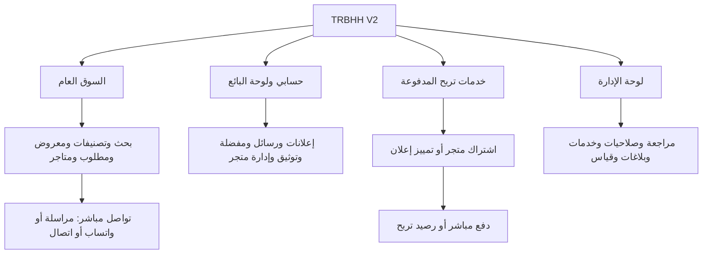

# TRBHH V2 — حزمة مراجعة المعمارية ورحلات المستخدم

11 سبتمبر 2026 · الإصدار 0.1 · **جاهز للمراجعة، ولم يبدأ تنفيذ الموقع.**

المقترح: تجربة جديدة لتربح مع الحفاظ على أساس النظام وبياناته. حساب واحد يخدم المشتري والبائع وصاحب المتجر. السوق يوصل الأطراف مباشرة، وخدمات تربح المدفوعة لها مسار مستقل واضح.

## ابدأ من هنا

| الوثيقة | ما ستراجعه |
|---|---|
| [1. المعمارية](01-architecture.md) | مجالات النظام وعلاقات البيانات والصفحات الـ12 والدفع والرصيد والعزل والأداء |
| [2. رحلات المستخدم](02-user-flows.md) | 10 رحلات، 6 مخططات، حالات النجاح والتعثر ومعايير قبول كل رحلة |
| [3. حفظ البيانات والإطلاق](03-migration-and-release.md) | 9 مراحل ببوابات مرور، مصالحة الأرصدة، حفظ الصور والحقوق، واختبار الرجوع |
| [الشعار المعتمد](assets/approved-logo-reference.jpg) | نسخة مطابقة للصورة المرفقة؛ مرجع مرحلة نظام التصميم المقبلة |

## الصورة العامة

## ما ثبتناه في التصميم

- **تجربة جديدة وبيانات مستمرة:** نبني الصفحات ورحلات الاستخدام من جديد، ونطور المجالات الحالية مع حفظ IDs والحسابات والصور والتاريخ.
- **تواصل P2P:** إعلان ثم تواصل ثم اتفاق مباشر بين الطرفين؛ تربح لا يحصل قيمة السلعة ولا يأخذ عمولة.
- **رصيد خدمات فقط:** شحن وسجل ودفع لخدمات تربح. الطلب المعلق يمكن استكماله دون تكرار الخصم أو ضياع سياقه.
- **مطلوب الآن جزء أساسي من السوق:** إعلان طلب واضح، بميزانية اختيارية ومطابقة مع المعروض، ثم تواصل يختاره المستخدم.
- **المتجر كيان احترافي:** صفحة عامة `/store/[handle]` وإدارة في `/seller/store`، مع حفظ الروابط القديمة وحقوق الاشتراك.
- **الثقة بالأدلة:** التوثيق يحدد ما تحقق منه، والتمييز ظهور مدفوع فقط. نقرة الاتصال ليست بيعًا مثبتًا.
- **حفظ البيانات شرط للإطلاق:** انتهاء إعلان أو اشتراك لا يحذف المحتوى. الأرصدة والمشتريات القديمة تُراجع وتُحفظ قبل الانتقال إلى نموذج V2.

## نقاط تحتاج علاجًا تقنيًا وقد أدرجت حلولها

| النقطة | العلاج داخل التصميم |
|---|---|
| `/store` حاليًا لوحة إدارة | فصل المسار العام والإداري وخريطة تحويل للروابط |
| التصنيفات قديمة وخاملة | شجرة V2 وخريطة ربط؛ اعتمادك الحالي هو المرجع |
| بعض الخدمات القديمة أوسع من نموذج دخل V2 | إيقاف بيعها مستقلّة في V2 مع حفظ التاريخ والحقوق المدفوعة |
| الدفع الحالي مرتبط بالشحن | تمييز غرض الدفع: شراء خدمة مباشرة أو شحن رصيد |
| ملفات ومهام تعتمد على الخادم الحالي | تخزين دائم وعامل خلفي وموارد منفصلة لتجهيز Vercel Preview |

## حدود هذه الدفعة

الفرع المحلي: `codex/trbhh-v2-architecture`، داخل نسخة عمل منفصلة `trbhh-v2-design`، ومبني على `6663a7275e8c16ca13c70c1f6682291a9103845b`.

التغييرات محصورة في وثائق التصميم وصورة الشعار المرجعية. لم تتغير ملفات التطبيق أو قاعدة البيانات أو إعدادات النشر. لم يحدث push أو نشر إلى Vercel أو Production في هذه الدفعة؛ المعاينة التطبيقية على Vercel خطوة لاحقة بعد التصميم وتجهيز العزل.

الأسعار والأعداد ومدد التمييز ليست محسومة، لذلك صُممت كإعدادات دون اختراع قيم. سياسات انتهاء الاشتراك ومعالجة خدمة مدفوعة تعذر تنفيذها تحتاج تثبيتًا قبل تفعيل الدفع، ولا توقف مراجعة المعمارية والرحلات.

## ترتيب المراجعة والمتابعة

1. مراجعة حدود المعمارية ورحلات المشتري والبائع والمتجر والدفع.
2. تجهيز نظام التصميم من الشعار المعتمد: فحمي وذهبي وسوق فاتح، نسخة مسطحة للأحجام الصغيرة، ومكونات الجوال والكمبيوتر.
3. تجهيز Wireframes للرئيسية وصفحة الإعلان وإضافة الإعلان والمتجر ولوحة البائع، ومراجعتها معك.
4. بعد اعتماد التصميم: تنفيذ تدريجي على فرع مستقل، ثم Vercel Preview معزولة واختبارات التجربة والبيانات.
5. إطلاق منفصل بعد قبول النسخة ونجاح خطة الترحيل والاستعادة والموافقة على النقل.

عند المراجعة تكفي الإشارة إلى رقم القسم أو الرحلة، مثل «ر4: أريد تقليل خطوات إضافة الإعلان». القرارات التجارية والهوية المعتمدة تبقى أساس العمل.
